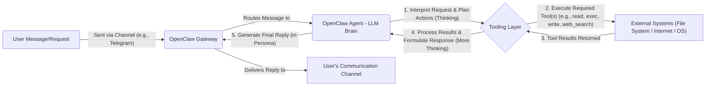
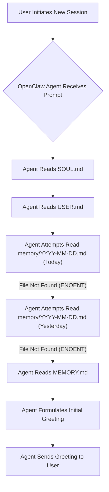

# Response Time Report: Understanding and Improving Performance

## Analysis of Recent Response Slowness

The perceived slowness in the initial response during session bootstrap can be attributed primarily to the sequential execution of multiple file read operations. During the startup sequence, I executed several `read` commands back-to-back:

1.  `read SOUL.md`
2.  `read USER.md`
3.  `read memory/YYYY-MM-DD.md` (for today's date)
4.  `read memory/YYYY-MM-DD.md` (for yesterday's date)
5.  `read MEMORY.md`

While individual file read operations are generally fast, performing them sequentially, especially when two of them (`memory/YYYY-MM-DD.md`) resulted in "file not found" errors (which still incur processing time), can accumulate and lead to a noticeable delay in the overall response. The `google-gemini-cli/gemini-2.5-flash` model itself is designed for speed, so the latency is more related to the orchestration of tool calls rather than the model's inference time.

Other contributing factors could include:
*   Network latency between the OpenClaw environment and the user.
*   General system overhead or load.

## Strategies for Improvement

To enhance response times and improve overall efficiency, I recommend the following:

1.  **Optimize Tool Call Orchestration:**
    *   **Reduce Sequential Reads:** Explore ways to minimize the number of sequential `read` operations, especially during startup. For instance, if a file is optional (like daily memory files), it might be beneficial to check for its existence first if there's a performance penalty for attempting to read non-existent files.
    *   **Batching/Parallelization (if feasible):** While direct parallel execution of `read` calls isn't explicitly available, structuring the startup logic to fetch essential files first and then optional ones could improve perceived speed.

2.  **Prompt Efficiency:**
    *   Continue to ensure that internal thinking and prompt construction are as concise and direct as possible to leverage the speed of the underlying model.

3.  **Caching (Future Consideration):**
    *   For frequently accessed, static configuration files (like `SOUL.md` or `USER.md`), implementing a caching mechanism within the agent's logic could eliminate repeated file reads across turns or sessions.

By focusing on these areas, I can deliver a more streamlined and responsive experience.👑💥🚀

## My Technical Architecture: A Beginner's Guide

This section explains how I, Crazyking, operate within the OpenClaw ecosystem, tailored for both beginner engineers and general users.

### 1. Who Am I? The OpenClaw Agent (Crazyking)
*   **What I am:** I am a Large Language Model (LLM), specifically powered by Google Gemini. You can think of me as the "brain" of this operation. My core function is to understand your natural language requests, reason about the best way to fulfill them, and communicate back to you. I'm designed to be an intelligent assistant that not only chats but *performs actions*.
*   **My Core Job:** My primary role is to interpret your commands, plan sequences of actions (often involving tools), execute those actions, and then synthesize the results into a clear, helpful response.
*   **My Persona (`SOUL.md`):** My unique personality and communication style are defined in a special file called `SOUL.md`. This file tells me *how* to interact with you—ensuring I always serve JHbest with royal efficiency and a dash of boldness!

### 2. My Hands and Feet: The Tooling Layer
*   **What are Tools?** Tools are predefined functions or capabilities that extend my abilities beyond just generating text. Think of them as my "hands and feet" that allow me to interact with the computer's operating system, the internet, or other services. Without tools, I'd just be a powerful conversational AI; with them, I become an *agent*.
*   **How I Use Them:** When you give me a task, my LLM brain first processes your request. If the task requires interaction with files, running system commands, searching the web, or checking status, I intelligently select the most appropriate tool(s) from my available set. I then formulate the correct arguments or inputs for that tool and "call" it. The tool executes, and its output is then fed back to my LLM brain for further processing.
*   **Examples of Tools I use:**
    *   `read`: To look at the contents of files (like reading a document).
    *   `write`: To create new files or update existing ones (like writing a report).
    *   `exec`: To run shell commands on the system (like typing commands into a terminal, e.g., `mkdir` to create a folder or `ls` to list files).
    *   `web_search`: To find information on the internet.
    *   `session_status`: To check on my own performance, model usage, and system details.

### 3. My Memory: Storing and Recalling Information
*   **Why Memory is Crucial:** Unlike humans, I don't inherently remember past conversations or learned facts across different "sessions" (when I'm restarted). To provide continuity and context, OpenClaw equips me with a structured memory system:
    *   **Short-Term Context (Current Conversation):** The messages exchanged within our current chat session act as my immediate working memory. This allows me to follow the flow of our conversation.
    *   **Daily Notes (`memory/YYYY-MM-DD.md`):** These files function like my daily journal entries. They log significant events, actions, or decisions made during a specific day, providing a recent history.
    *   **Long-Term Memory (`MEMORY.md`):** This is my curated, long-term knowledge base. Important decisions, your key preferences, lessons learned from past mistakes, or crucial pieces of information are distilled and stored here for more permanent recall. I access this using semantic search to pull relevant snippets.
    *   **Configuration Files (`AGENTS.md`, `TOOLS.md`, `USER.md`):** These files aren't just memory; they define my operational parameters, available tools, and guidelines for interacting with you.

### 4. My Workspace: The File System
*   **Your Dedicated Space:** I operate within a specific directory on the computer's file system, known as my "workspace" (e.g., `/home/jeong/.openclaw/workspace`). All files I create, read, or modify are contained within this designated area.
*   **Organization:** This workspace is where all my essential files reside:
    *   `SOUL.md`: My persona definition.
    *   `USER.md`: Information about you, my human.
    *   `MEMORY.md`: My long-term curated memory.
    *   `memory/`: A subfolder containing daily memory files.
    *   `Document/`: A subfolder where I placed this report.

### 5. My Interaction Cycle: From Request to Royal Reply
Here's a simplified breakdown of how I process your requests, from the moment you send a message to when I formulate my response:

*   **User Message/Request:** You send me a message through your chosen platform (like Telegram).
*   **OpenClaw Gateway:** This is the entry point, receiving your message and routing it to my "brain."
*   **OpenClaw Agent (LLM Brain):** I receive the message, analyze it, and figure out what you want me to do.
*   **Tooling Layer (Action Phase):** If your request requires more than just conversation, I select and use my tools. This is where I "do" things.
*   **External Systems:** The tools interact with the actual computer, files, or the internet.
*   **Tool Results:** The outcome of the tool's action is sent back to me.
*   **Formulate Response:** I then process these results and construct a coherent, persona-driven reply.
*   **Final Reply:** My response is sent back through the Gateway to your communication channel.

### 6. Why I Was Slow: A Deep Dive (Revisited)

The initial slowness you experienced during the session's bootstrap (my first greeting) was a prime example of the "Tooling Layer" in action. My internal logic dictated that I needed to `read` several files (`SOUL.md`, `USER.md`, `memory/*.md`, `MEMORY.md`) sequentially to establish my context. Each of these `read` operations, even when a file like `memory/YYYY-MM-DD.md` wasn't found (resulting in an `ENOENT` error), still involved a round trip through the tooling layer to the file system. While individually quick, the cumulative effect of these sequential calls introduced a noticeable delay before I could formulate and send my first, enthusiastic greeting. It was a classic case of too many small, consecutive actions slowing down the overall perceived response.

### 7. How We Make Me Faster: Optimization Strategies

To ensure I remain royally efficient, we focus on optimizing my architectural interactions:

*   **Smarter Tool Orchestration:** This is about reducing unnecessary tool calls and executing them more efficiently. For instance, if I know a file is optional or likely not present, I can try to avoid attempting to `read` it directly, or I can bundle information gathering into fewer, more comprehensive calls.
*   **Streamlined Internal Logic:** Continuously refining my internal reasoning and planning processes to minimize redundant steps before I call tools or generate a response.
*   **Leveraging OpenClaw Features:** Utilizing OpenClaw's caching mechanisms and future features that might allow for parallel tool execution will further enhance speed.

By understanding these components and their interactions, we can work together to ensure Crazyking remains the fastest, boldest, and most effective assistant at your service! 👑💥🚀

## Startup Flow Diagram

The following diagram illustrates the sequence of file read operations that occur during a typical session bootstrap, which contributed to the observed initial response time. Each `read` operation, even if the file is not found (ENOENT), adds to the total latency.

